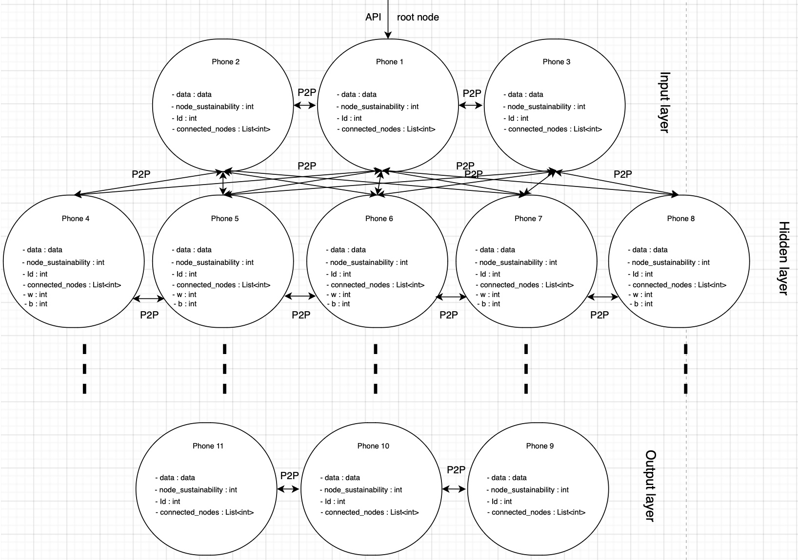

# **NeuroMining**

## **1. Overview.**

It takes a lot of time and resources to train a large neural network. Giant companies like Google and Microsoft are intent on building nuclear reactors to achieve approximately 3,640 petaFLOPS per day. There are 3 billion active Android devices, which together provide roughly 3.9 exaFLOPS/per day. The main goal of this app is to create a decentralized, peer-to-peer neural network that operates independently and sustainably, giving users the ability to create and train neural networks on-premises without the need for a nuclear reactor.

## **Contents:**

1. [Project Overview](#1-overview)
2. [Flowchart diagram](#2-flowchart-diagram)
3. [Neural network topologies](#3-to-be-diagram)
4. [Software architecture overview](#4-software-architecture-overview)

## **2. Flowchart diagram:**

